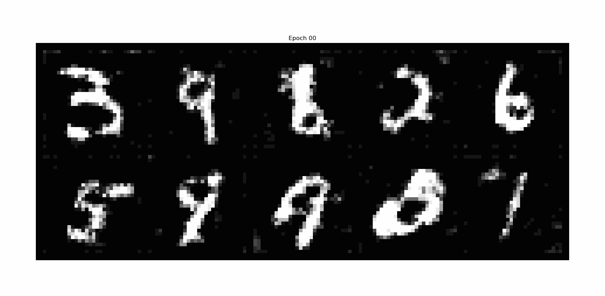
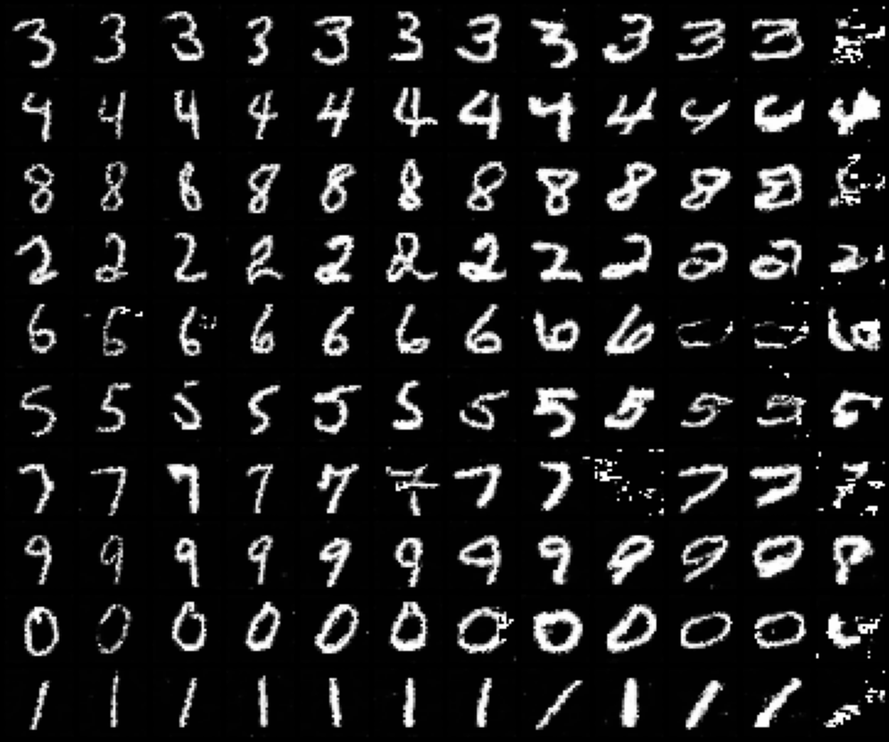
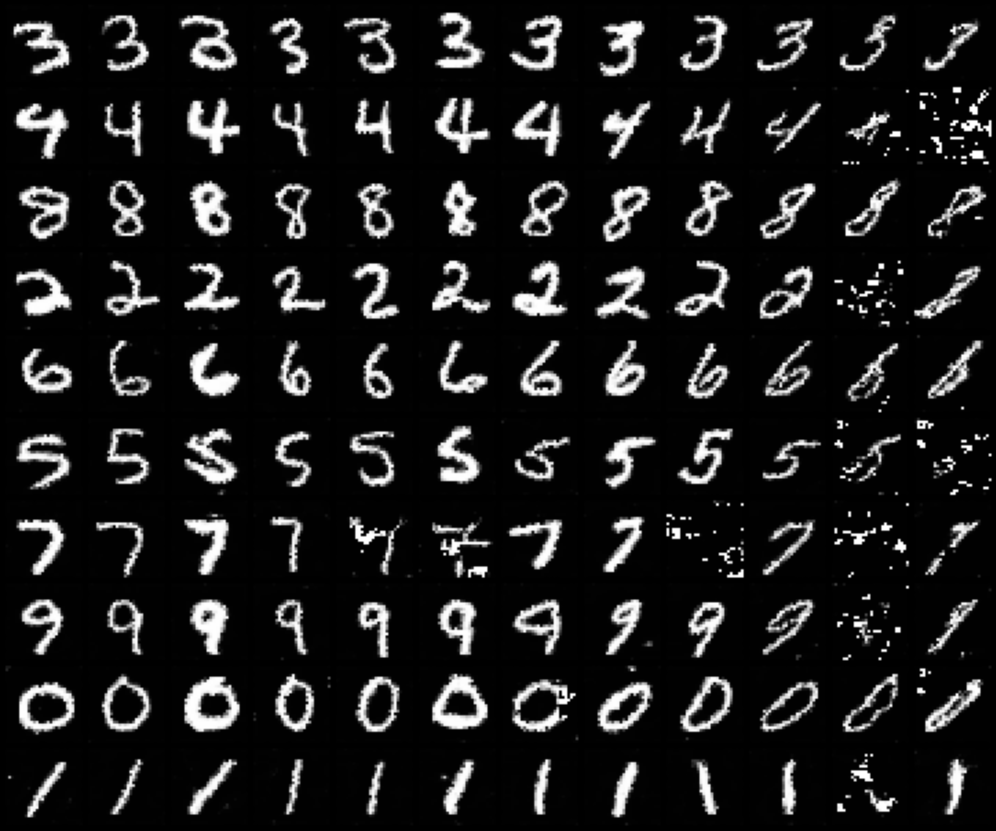

# InfoGAN

Original paper: [InfoGAN: Interpretable Representation Learning by Information Maximizing Generative Adversarial Nets](https://arxiv.org/abs/1606.03657)

This paper extends GANs with a new formulation using mutual information.
It learns disentangled representations.
Mutual information between a small subset of the latent variables and the observation is maximized.

Here is, the objective function of the classical GAN:

$$
V(D, G) = \mathbb{E}_{x \sim p_{\text{data}}}[\log D(x|y)] + \mathbb{E}_{z \sim p_z}[\log (1 - D(G(z|y)))]
$$

Classical GAN does not impose restrictions on how noise is used by the generator.

This paper proposed to use new inputs (concatenation):
- noise
- latent code which target structured sematic features. For example, in case of MNIST dataset, features can be the orientation or the thickness of the digits.

InfoGan is an information-regularized version that learns disentangled representations, represented by latent code $c=(c_1,...,c_L)$.
Here, the idea is to maximize the mutual information between latent code $c$ and the generator distribution $G(z,c)$.
It is noted $I(c,G(z,c))$.

Mutual information $I(X,Y)$ measures the amout of information learned from knowledge of random variable $Y$ about the random variable $X$. It is interpreted as a reduction of uncertainty in $X$ when $Y$ is observed.

$$I(X,Y)=H(X) - H(X|Y) = H(Y) - H(Y|X)$$
$H$ being entropy.

Thanks to mutual information lower bound ($L_I(G,Q)$), the information-regularized minimax game becomes:

$$
\min_{G,Q} \max_D V_{\text{InfoGAN}}(D, G, Q) = V(G,D) - \lambda L_I(G,Q)
$$
$Q(c|x)$ being an auxiliary distribution to approximate $p(c|x)$.

## Results
This is the evolution of samples generated from a fixed noise vector after each epoch.

This are the results when we vary $c_2$ from $-2$ to $2$.
<!-- We can see that the thickness is varying. -->

This are the results when we vary $c_3$ from $-2$ to $2$.
<!-- Here the orientation is the varying information. -->

